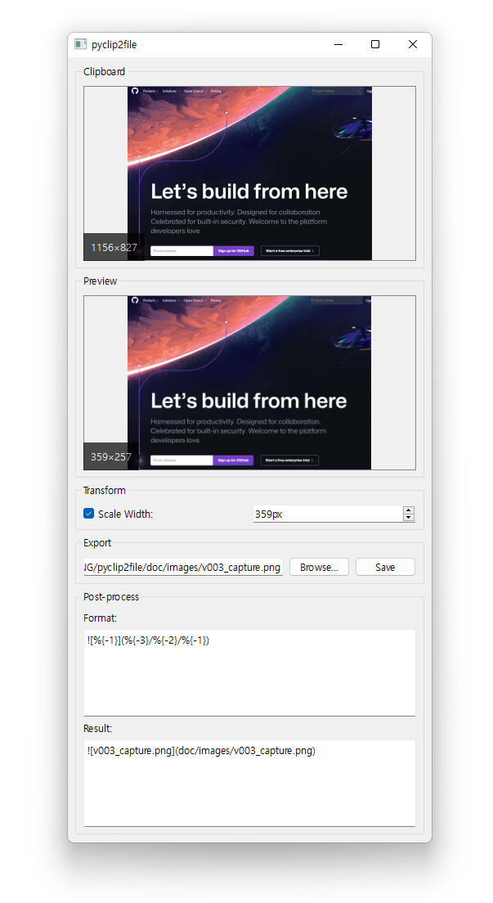

# hvppycapture

hvppycapture is a program that saves clipboard images to files.

## v0.0.1

- Created a `setup.py` file
- "Hello World" Example

## v0.0.2

- Implemented basic funtionalities
- Plugin system(reference: spyder IDE)

## v0.0.3

- Added preview window
- Added post-process feature

## v0.0.4

- Changed this project's name(pyclip2file→hvppycapture)
